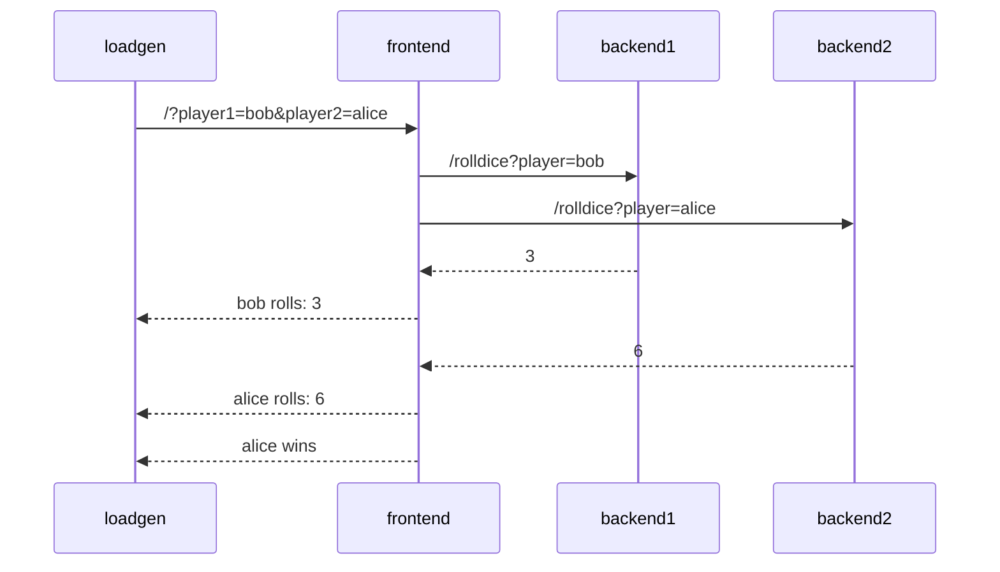

# Auto-instrumentation

## Application Description

The sample application is a simple _"dice game"_, where two players roll a
dice, and the player with the highest number wins.

There are 3 microservices within this application:

- Service `frontend` in Node.JS, that has an API endpoint `/` which takes two
  player names as query parameters (player1 and player2). The service calls 2
  down stream services (backend1, backend2), which each returning a random number
  between 1-6. The winner is computed and returned.
- Service `backend1` in python, that has an API endpoint `/rolldice` which takes
  a player name as query parameter. The service returns a random number between
  1 and 6.
- Service `backend2` in Java, that also has an API endpoint `/rolldice` which
  takes a player name as query parameter. The service returns a random number
  between 1 and 6.

Additionally there is a `loadgen` service, which utilizes `curl` to periodically
call the frontend service.

Let's assume player `alice` and `bob` use our service, here's a potential
sequence diagram:

---
[Next steps](./04-manual-instrumentation.md)
