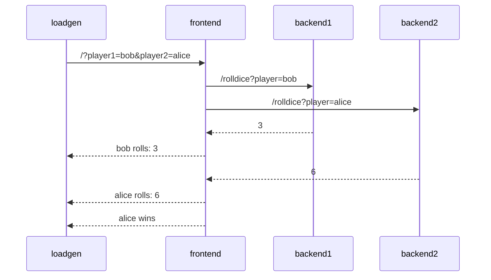

# Auto-instrumentation

## Application Description

The sample application is a simple _"dice game"_, where two players roll a
dice, and the player with the highest number wins.

There are 3 microservices within this application:

- Service `frontend` in Node.JS, that has an API endpoint `/` which takes two
  player names as query parameters (player1 and player2). The service calls 2
  down stream services (backend1, backend2), which each returning a random number
  between 1-6. The winner is computed and returned.
- Service `backend1` in python, that has an API endpoint `/rolldice` which takes
  a player name as query parameter. The service returns a random number between
  1 and 6.
- Service `backend2` in Java, that also has an API endpoint `/rolldice` which
  takes a player name as query parameter. The service returns a random number
  between 1 and 6.

Additionally there is a `loadgen` service, which utilizes `curl` to periodically
call the frontend service.

Let's assume player `alice` and `bob` use our service, here's a potential
sequence diagram:



## Manual or Automatic Instrumentation?

To make your application emit traces, metrics & logs you can either instrument
your application _manually_ or _automatically_:

- Manual instrumentation means that you modify your code yourself: you initialize and
  configure the SDK, you load instrumentation libraries, you create your own spans,
  metrics using the API.
  Developers can use this approach to tune the observability of their application to
  their needs, but it requires a lot of initial time investment, expertise how (RPC) frameworks and client work and maintenance over time.
- Automatic instrumentation means that you don't have to touch your code to get your
  application emit telemetry data.
  Automatic instrumentation is great to get you started with OpenTelemetry, and it is
  also valuable for Application Operators, who have no access or insights about the
  source code.

In this chapter we will cover using OpenTelemetry auto-instrumentation.


## Instrument the demo application

In this section we will deploy the app into Kubernetes and instrument it with OpenTelemetry auto-instrumentation
using the [Instrumentation CRD](https://github.com/open-telemetry/opentelemetry-operator?tab=readme-ov-file#opentelemetry-auto-instrumentation-injection) provided by the OpenTelemetry operator.
Then we will modify the app to create custom spans and collector additional attributes.

### Deploy the app into Kubernetes

Deploy the application into the kubernetes cluster. The app will be deployed into `tutorial-application` namespace.

```bash
kubectl apply -f https://raw.githubusercontent.com/pavolloffay/kubecon-eu-2024-opentelemetry-kubernetes-tracing-tutorial/main/app/k8s.yaml
kubectl get pods -n tutorial-application -w
```

Now port-forward the frontend app:

```bash
kubectl port-forward service/frontend-service -n tutorial-application 4000:4000 
```

Open browser at [http://localhost:4000/](http://localhost:4000/).

### Deploy OpenTelemetry collector

Deploy OpenTelemetry collector that will receive data from the instrumented workloads.

```bash
kubectl apply -f https://raw.githubusercontent.com/pavolloffay/kubecon-eu-2024-opentelemetry-kubernetes-tracing-tutorial/main/backend/03-collector.yaml
```

### Create instrumentation CR and see traces in the Jaeger console

Now let's instrument the app with the `Instrumentation` CR and see traces in the Jaeger console.

First the Instrumentation CR needs to be created in the `tutorial-application` namespace:

```bash
kubectl apply -f https://raw.githubusercontent.com/pavolloffay/kubecon-eu-2024-opentelemetry-kubernetes-tracing-tutorial/main/app/instrumentation.yaml
```

The `Instrumentation` CR does not instrument the workloads. The instrumentation needs to be enabled by annotating a pod:

```bash
kubectl patch deployment frontend-deployment -n tutorial-application -p '{"spec": {"template":{"metadata":{"annotations":{"instrumentation.opentelemetry.io/inject-sdk":"true"}}}} }'
kubectl patch deployment backend1-deployment -n tutorial-application -p '{"spec": {"template":{"metadata":{"annotations":{"instrumentation.opentelemetry.io/inject-python":"true"}}}} }'
kubectl patch deployment backend2-deployment -n tutorial-application -p '{"spec": {"template":{"metadata":{"annotations":{"instrumentation.opentelemetry.io/inject-java":"true"}}}} }'
```

Now let's execute some requests on the app [http://localhost:4000/](http://localhost:4000/) and see traces in the Jaeger console [http://localhost:16686/](http://localhost:16686/).

### Customize spans created by the auto-instrumentation

In this section we will modify [Java backend2](./app/backend2) service to:  
* create a new span to observe execution of a business method
* attach attributes to span

The OpenTelemetry Java auto-instrumentation supports `@WithSpan`, `@SpanAttribute` and `@AddingSpanAttributes` see the [documentation](https://opentelemetry.io/docs/languages/java/automatic/annotations/) and [javadoc](https://javadoc.io/doc/io.opentelemetry.instrumentation/opentelemetry-instrumentation-annotations/latest/io/opentelemetry/instrumentation/annotations/package-summary.html).

Open the [RollController.java](./app/backend2/src/main/java/io/opentelemetry/dice/RollController.java) and use the annotations:

```java
    @AddingSpanAttributes
	@GetMapping("/rolldice")
	public String index(@SpanAttribute("player") @RequestParam("player") Optional<String> player) {

    @WithSpan
    public int getRandomNumber(@SpanAttribute("min") int min, @SpanAttribute("max") int max) {
        return (int) ((Math.random() * (max - min)) + min);
    }
```

Compile it and deploy:
```bash
cd /app/backend2

# Use minikube's docker registry
eval $(minikube -p minikube docker-env)
docker build -t pavolloffay/tutorial-backend2:withspan .
# docker push pavolloffay/tutorial-backend2:withspan

kubectl set image deployment.apps/backend2-deployment backend2=pavolloffay/tutorial-backend2:withspan -n tutorial-application
kubectl get pods -w -n tutorial-application
```


### Customize Java auto-instrumentation

In this section we will configure the Java auto-instrumentation by modifying `Instrumentation` CR to:
* create custom spans - for the main method of the application
* capture server response HTTP headers

```bash
kubectl apply -f https://raw.githubusercontent.com/pavolloffay/kubecon-eu-2024-opentelemetry-kubernetes-tracing-tutorial/main/app/instrumentation-java-custom-config.yaml
kubectl rollout restart deployment.apps/backend2-deployment -n tutorial-application
```


---
[Next steps](./04-manual-instrumentation.md)
