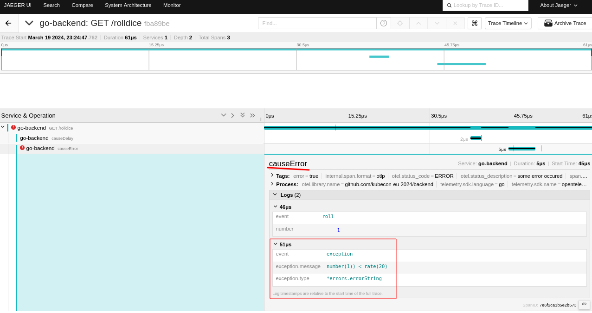
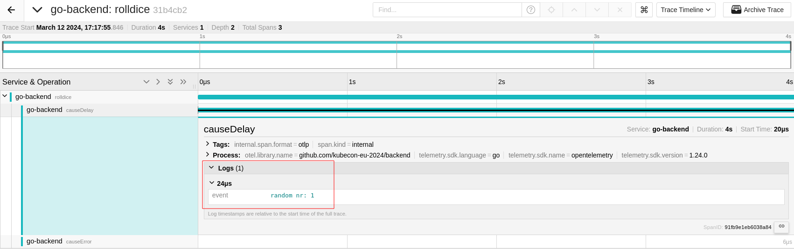

# Manual instrumentation using the OpenTelemetry SDK

This tutorial section covers the manual instrumentation of a go application with the opentelemetry-sdk.

As a basis for the instrumentation we use [backend4](./app/backend4/main.go). To compile the application you need [go 1.22 or newer](https://go.dev/doc/install).

# Initialize OpenTelemetry-go-sdk

Before we start instrumenting our application, we should create a standard tracer and register it globally. This ensures that the same exporter is used throughout the application and that the same process steps are performed.

```diff
func main() {
+	otelExporter, err := otlptracegrpc.New(context.Background())
+	if err != nil {
+		fmt.Printf("failed to create trace exporter: %s\n", err)
+		os.Exit(1)
+	}
+	tp := sdktrace.NewTracerProvider(sdktrace.WithBatcher(otelExporter))
+	otel.SetTracerProvider(tp)
...
```


### Create and register a global trace provider

First we have to create a tracer that identifies our specific service.

```diff
+var tracer = otel.GetTracerProvider().Tracer("github.com/kubecon-eu-2024/backend")
```

## Identifying critical path and operations for instrumentation

As we begin to instrument our application, we should remember that no data is free. By focusing on the most critical endpoint and its associated functions, we can ensure that our instrumentation efforts are focused on capturing the most valuable telemetry. Let's explore how we can instrument these key components to improve the observability and reliability of our application.

In our example backend, the entry point `/rolldice` starts our critial operation.

Using the prevously defined tracer, we can create a new spans. The method `Start` creates a span and a `context.Context` containing the newly-created span. If the context.Context provided in `ctx` contains a Span then the newly-created Span will be a child of that span, otherwise it will be a root span.

Keep in mind that any Span that is created `MUST` also be ended. This is the responsibility of the user. Implementations of this API may leak memory or other resources if Spans are not ended. [Documentation](https://pkg.go.dev/go.opentelemetry.io/otel/trace#Tracer).

When defining a span name, it's important to choose descriptive and meaningful names that accurately reflect the operation being performed.

```diff
	mux := http.NewServeMux()

+	registerHandleFunc := func(pattern string, h http.HandlerFunc) {
+		route := strings.Split(pattern, " ")
+		mux.Handle(pattern, otelhttp.NewHandler(otelhttp.WithRouteTag(route[len(route)-1], h), pattern))
+	}
```

To simulate a more complex behaviour, we find a `causeError` function in the `/rolldice` handler source code of the backend4 application. Since there is a defined probability that errors will occur, it makes sense to take this part into account as well.

Therefore we have to make sure that the context, which was previously created with the rootspan, is passed to this function. 

### RecordError and set span status

RecordError will record err as an exception span event for this span. An additional call to SetStatus is required if the Status of the Span should be set to Error, as this method does not change the Span status. If this span is not being recorded or err is nil then this method does nothing.

```diff
func causeError(ctx context.Context, rate int) error {
+	_, span := tracer.Start(ctx, "causeError")
+	defer span.End()

	randomNumber := rand.Intn(100)
+	span.AddEvent("roll", trace.WithAttributes(attribute.Int("number", randomNumber)))
	if randomNumber < rate {
		err := fmt.Errorf("number(%d)) < rate(%d)", randomNumber, rate)
+		span.RecordError(err)
+		span.SetStatus(codes.Error, "some error occured")
		return err
	}
	return nil
}
```

In the same execution path we also find a function that ensures high delays of our `/rolldice` endpoint with a fixed probability.



### Add a custom Event

AddEvent adds an event with the provided name and optionsAddEvent adds an event with the provided name and options.

```diff
func causeDelay(ctx context.Context, rate int) {
+	_, span := tracer.Start(ctx, "causeDelay")
+	defer span.End()
	randomNumber := rand.Intn(100)
+	span.AddEvent("roll", trace.WithAttributes(attribute.Int("number", randomNumber)))
	if randomNumber < rate {
		time.Sleep(time.Duration(2+rand.Intn(3)) * time.Second)
	}
}
```



Once the code has been instrumented, we can use `go mod tidy` to update the existing `go.mod` file and start testing our application.

## Apply Backend4 to the Kubernetes test cluster

Now that we have instrumentalised `backend4`, we can use it as a drop-in replacement for `backend2`.

For this we need to build and provide a new container image or use the prepared `backend4:with-instr` version.

```bash
kubectl apply -f https://raw.githubusercontent.com/pavolloffay/kubecon-eu-2024-opentelemetry-kubernetes-tracing-tutorial/main/app/instrumentation-replace-backend2.yaml
```

When using `kubectl diff` we should see something similar to this.

```diff
apiVersion: apps/v1
kind: Deployment
metadata:
  name: backend2-deployment
  namespace: tutorial-application
  labels:
    app: backend2
spec:
  template:
    metadata:
      labels:
        app: backend2
      annotations:
        prometheus.io/scrape: "true"
+        instrumentation.opentelemetry.io/inject-sdk: "true"
  template:
    spec:
      containers:
      - name: backend2
-        image: ghcr.io/pavolloffay/kubecon-eu-2024-opentelemetry-kubernetes-tracing-tutorial-backend2:latest
+        image: ghcr.io/frzifus/kubecon-eu-2024-opentelemetry-kubernetes-tracing-tutorial-backend4:with-instr
        env:
+        - name: RATE_ERROR
+          value: 20
+        - name: RATE_HIGH_DELAY
+          value: 20
```

> [!NOTE]  
> This is an optional section.

<details>

<summary>Run and test backend 4 locally (shorter development cycle)</summary>

## Configuring an OTLP exporter and setting the endpoint

To get quick feedback, we can run a Jaeger instance locally and point our application at it. Jaeger all-in-one will make this easy.

```bash
docker run --rm -it -p 127.0.0.1:4317:4317 -p 127.0.0.1:16686:16686 -e COLLECTOR_OTLP_ENABLED=true -e LOG_LEVEL=debug  jaegertracing/all-in-one:latest
```

Now we can configure our application with a specific `RATE_ERROR` and `RATE_DELAY` in `%`. This indicates how many traces should be delayed and/or cause an error.

Finally we need to configure the OpenTelemetry-SDK, by default we can use common environment variables. [Documentation](https://opentelemetry.io/docs/languages/sdk-configuration/)

```bash
OTEL_EXPORTER_OTLP_ENDPOINT=http://localhost:4317 OTEL_SERVICE_NAME=go-backend RATE_ERROR=20 RATE_HIGH_DELAY=20 go run main.go
```

</details>

---

By instrumenting our applications, whether manually or automatically, we get more telemetry data to help us understand our system. However, since a large amount of telemetry data also generates costs, in the next chapter we will discuss how we can utilise this amount in a meaningful way. 

---

[Next steps](./05-sampling.md)
