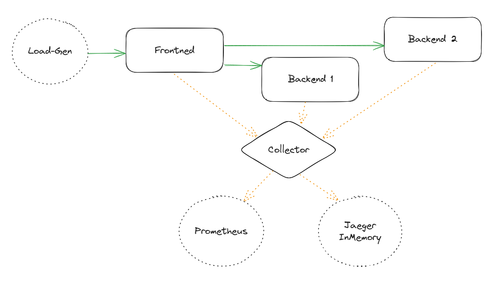
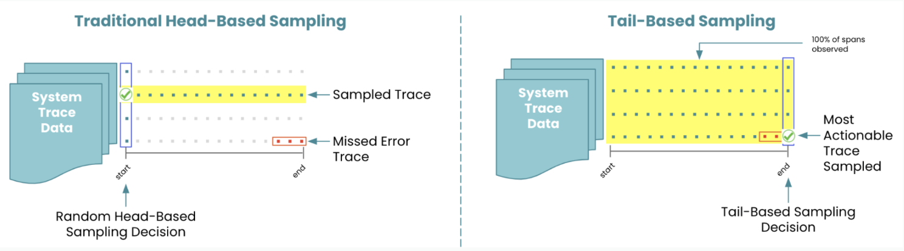
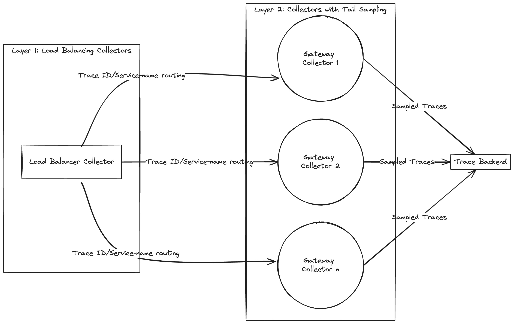

# Sampling

This tutorial step covers the basic usage of the OpenTelemetry Collector on Kubernetes and how to reduce costs using sampling techniques.

## Overview



[excalidraw](https://excalidraw.com/#json=15BrdSOMEkc9RA5cxeqwz,urTmfk01mbx7V-PpQI7KgA)

## Sampling, what does it mean and why is it important?

Sampling refers to the practice of selectively capturing and recording traces of requests flowing through a distributed system, rather than capturing every single request. It is crucial in distributed tracing systems because modern distributed applications often generate a massive volume of requests and transactions, which can overwhelm the tracing infrastructure or lead to excessive storage costs if every request is traced in detail.

For example, a medium sized setup producing ~1M traces per minute can result in a cost of approximately $250,000 per month. (Note that this depends on your infrastructure costs, the SaaS provider you choose, the amount of metadata, etc.)

For more details, check the [offical documentation](https://opentelemetry.io/docs/concepts/sampling/).

### How can we now reduce the number of traces?


### Comparing Sampling Approaches



### Head based sampling

Head sampling is a sampling technique used to make a sampling decision as early as possible. A decision to sample or drop a span or trace is not made by inspecting the trace as a whole.

Update the sampling % in the Instrumentation CR and restart the deployment for the configurations to take effect.

https://github.com/pavolloffay/kubecon-eu-2024-opentelemetry-kubernetes-tracing-tutorial/blob/d4b917c1cc4a411f59ae5dd770b22de1de9f6020/app/instrumentation-head-sampling.yaml#L13-L15

```yaml
kubectl apply -f https://raw.githubusercontent.com/pavolloffay/kubecon-eu-2024-opentelemetry-kubernetes-tracing-tutorial/main/app/instrumentation-head-sampling.yaml
kubectl rollout restart deploy -n tutorial-application
kubectl get pods -w -n tutorial-application
```

See the pod spec for one of the deployment:

```bash
kubectl describe pod backend2-deployment-64ddcc76fd-w85zh -n tutorial-application
```

```diff
    Environment:
          OTEL_TRACES_SAMPLER:                 parentbased_traceidratio
-         OTEL_TRACES_SAMPLER_ARG:             1
+         OTEL_TRACES_SAMPLER_ARG:             0.5
```

### Tailbased Sampling

Tail sampling is where the decision to sample a trace takes place by considering all or most of the spans within the trace. Tail Sampling gives you the option to sample your traces based on specific criteria derived from different parts of a trace, which isn’t an option with Head Sampling.

Deploy the opentelemetry collector with `tail_sampling` enabled.

```shell
kubectl apply -f https://raw.githubusercontent.com/pavolloffay/kubecon-eu-2024-opentelemetry-kubernetes-tracing-tutorial/main/backend/05-collector-1.yaml
kubectl get pods -n observability-backend -w
```

```yaml
  # Sample 100% of traces with ERROR-ing spans (omit traces with all OK spans)
  # and traces which have a duration longer than 500ms
  processors: 
    tail_sampling:
      decision_wait: 10s # time to wait before making a sampling decision is made
      num_traces: 100 # number of traces to be kept in memory
      expected_new_traces_per_sec: 10 # expected rate of new traces per second
      policies:
        [          
          {
              name: keep-errors,
              type: status_code,
              status_code: {status_codes: [ERROR]}
            },
            {
              name: keep-slow-traces,
              type: latency,
              latency: {threshold_ms: 500}
            }
        ]
```

<TODO: Add screenshot>


-----
### Advanced Topic: Sampling at scale with OpenTelemetry

Requires two deployments of the Collector, the first layer routing all the spans of a trace to the same collector in the downstream deployment (using load-balancing exporter). And the second layer doing the tail sampling.



[excalidraw](https://excalidraw.com/#room=6a15d65ba4615c535a40,xcZD6DG977owHRoxpYY4Ag)

Apply the YAML below to deploy a layer of Collectors containing the load-balancing exporter in front of collectors performing tail-sampling:

```shell
kubectl apply -f https://raw.githubusercontent.com/pavolloffay/kubecon-eu-2024-opentelemetry-kubernetes-tracing-tutorial/main/backend/05-collector-2.yaml
kubectl get pods -n observability-backend -w
```

```bash
jaeger-bc5f49d78-627ct                    1/1     Running   0          100m
otel-collector-6cc77b975c-plqth           1/1     Running   0          15m
otel-gateway-collector-6bfbc5f68b-98wx5   1/1     Running   0          6m40s
otel-gateway-collector-6bfbc5f68b-hrrcq   1/1     Running   0          6m40s
prometheus-77f88ccf7f-dfwh2               1/1     Running   0          100m

```

<TODO: Add screenshot>

### Advanced Topic: Jaeger's Remote Sampling extension
 
TODO:
https://github.com/open-telemetry/opentelemetry-collector-contrib/blob/main/extension/jaegerremotesampling/README.md


[Next steps](./06-RED-metrics.md)
