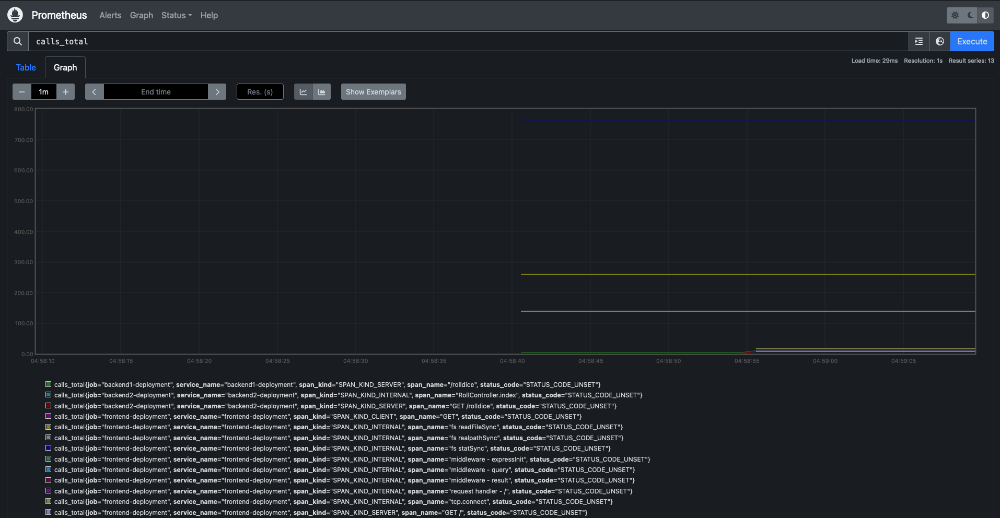

# RED Metrics

Now that we have introduced sampling we have reduced our visibility into the true shape and size of our traffic.
We can recover some of that visibility by sending our spans to the [`spanmetrics` connector](https://github.com/open-telemetry/opentelemetry-collector-contrib/tree/main/connector/spanmetricsconnector) in a separate collector pipeline.
This connector will derive Rate, Error, and Duration (RED) metrics from the spans it processes.

## Collector Configuration

The `spanmetrics` connector provides a reasonable starting point as its default configuration, so we will simply add it to our collector configuration and feed it trace data from the `otlp` receiver.

```diff
@@ -53,14 +54,20 @@
       debug:
         verbosity: detailed

+    connectors:
+      spanmetrics:
+
     service:
       pipelines:
         traces:
           receivers: [otlp]
           processors: [tail_sampling]
           exporters: [otlp/traces]
-        metrics:
+        traces/spanmetrics:
           receivers: [otlp]
+          exporters: [spanmetrics]
+        metrics:
+          receivers: [otlp,spanmetrics]
           exporters: [otlphttp/metrics]
         logs:
           receivers: [otlp]
```

With this change to our collector configuration the `spanmetrics` connector will consume spans from the `otlp` receiver, generate metrics from those spans, and produce those metrics on our `metrics` pipeline to the `otlphttp/metrics` exporter to Prometheus.

Let's apply this change to our collector deployment:

```bash
kubectl apply -f https://raw.githubusercontent.com/pavolloffay/kubecon-eu-2024-opentelemetry-kubernetes-tracing-tutorial/main/backend/06-collector.yaml
```

Once this change is applied we can query Prometheus for the `calls_total` metrics and observe the metrics generated from our trace data:



## Jaeger Configuration

To tie together our new RED metrics with our trace data we can configure Jaeger
to display service performance metrics from Prometheus.  We can do this by adding
environment variables that tell Jaeger where to find metrics and how to interpret them.

```yaml
- name: METRICS_STORAGE_TYPE
  value: "prometheus"
- name: PROMETHEUS_SERVER_URL
  value: "http://prometheus.observability-backend"
- name: PROMETHEUS_QUERY_SUPPORT_SPANMETRICS_CONNECTOR
  value: "true"
- name: PROMETHEUS_QUERY_NORMALIZE_CALLS
  value: "true"
- name: PROMETHEUS_QUERY_NORMALIZE_DURATION
  value: "true"
```

These new variables tell Jaeger that we are producing metrics into Prometheus using the
`spanmetrics` connector and that it should expect the `calls` and `duration` metric names
to be normalized for Prometheus as `calls_total` and `duration_milliseconds_*`.  With this
information Jaeger is able to query Prometheus and present a dashboard for each service
showing the RED metrics for all of its traced operations.


[Next steps](./07-ottl.md)
