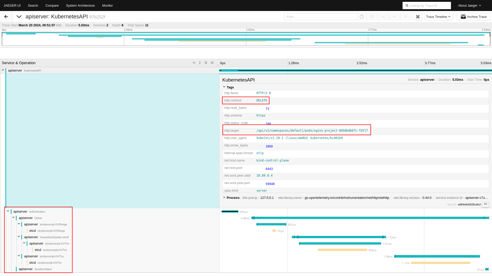
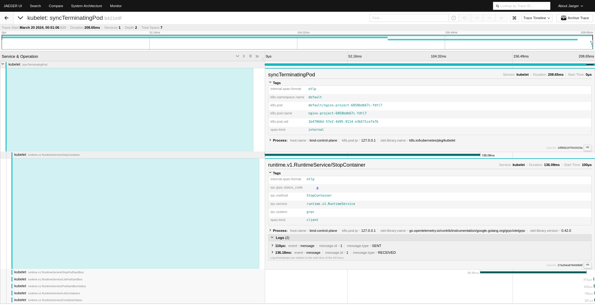
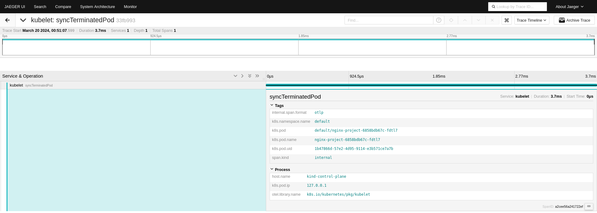

# Trace your k8s environment with OpenTelemetry

This part of the tutorial focuses on tracing etcd, kube-api-server and kubelet requests. It is assumed that the tracing backend from the previous sections has been successfully installed. If you do not use a kind cluster with the workshop setup you may want to check the blog post [Alpha in Kubernetes v1.22: API Server Tracing](https://kubernetes.io/blog/2021/09/03/api-server-tracing/) from David Ashpole.

<details>

<summary>Quick install guide...</summary>


The following installation steps are dependent on each other and should therefore be executed multiple times until they succeed or with some delay.

```bash
kubectl apply -f https://github.com/cert-manager/cert-manager/releases/download/v1.11.0/cert-manager.yaml
kubectl apply -f https://github.com/open-telemetry/opentelemetry-operator/releases/download/v0.94.0/opentelemetry-operator.yaml
kubectl apply -f https://raw.githubusercontent.com/pavolloffay/kubecon-eu-2024-opentelemetry-kubernetes-tracing-tutorial/main/backend/01-backend.yaml
kubectl apply -f https://raw.githubusercontent.com/pavolloffay/kubecon-eu-2024-opentelemetry-kubernetes-tracing-tutorial/main/backend/03-collector.yaml
```

</details>

The previously created workshop cluster already configured `etcd`, the `api-server` and `kubelet` to report all trace information to `localhost`. Using a [collector deployed as daemonset](./app/otel-daemonset.yaml) with hostnetwork access, we can capture this data and transmit it into the workshop backend. 


Deploy OpenTelemetry Collector as Daemonset with hostnetowrk access:
```bash
kubectl apply -f https://raw.githubusercontent.com/pavolloffay/kubecon-eu-2024-opentelemetry-kubernetes-tracing-tutorial/main/app/otel-daemonset.yaml
```

## ETCD

https://github.com/pavolloffay/kubecon-eu-2024-opentelemetry-kubernetes-tracing-tutorial/blob/f5bb1c22164d04d1fa16658ed20a7a15bfcd7d2f/kind-1.29.yaml#L23-L36

- [kubeadm Configuration (v1beta3)](https://kubernetes.io/docs/reference/config-api/kubeadm-config.v1beta3/#kubeadm-k8s-io-v1beta3-LocalEtcd)
- [PR #12919](https://github.com/etcd-io/etcd/pull/12919)

We can check the applied etcd config using kubectl:
```bash
kubectl get pods -n kube-system etcd-kind-control-plane -o yaml
```

This should be the effect:
```diff
spec:
  containers:
  - command:
    - etcd
    - --data-dir=/var/lib/etcd
+   - --experimental-distributed-tracing-address=127.0.0.1:4317
+   - --experimental-distributed-tracing-instance-id=caf201fd-8d5b-467b-a70f-09ad3beb5a21
+   - --experimental-distributed-tracing-sampling-rate=1000000
+   - --experimental-distributed-tracing-service-name=etcd
+   - --experimental-enable-distributed-tracing=true
    - --experimental-initial-corrupt-check=true
    image: quay.io/coreos/etcd:v3.5.11
  hostNetwork: true
```

## API-Server
 
To configure the tracing export of the API-Server we have to provide a [TracingConfiguration](https://kubernetes.io/docs/reference/config-api/apiserver-config.v1beta1/#apiserver-k8s-io-v1beta1-TracingConfiguration) CR.

<details>
<summary>Kind configuration</summary>

https://github.com/pavolloffay/kubecon-eu-2024-opentelemetry-kubernetes-tracing-tutorial/blob/f5bb1c22164d04d1fa16658ed20a7a15bfcd7d2f/kind-1.29.yaml#L37-L45
</details>

https://github.com/pavolloffay/kubecon-eu-2024-opentelemetry-kubernetes-tracing-tutorial/blob/f5bb1c22164d04d1fa16658ed20a7a15bfcd7d2f/app/api-server/tracing-config.yaml#L1-L4

We can check the applied API-Server config using kubectl:
```bash
kubectl get pods -n kube-system kube-apiserver-kind-control-plane -o yaml
```

This should be the effect:
```diff
spec:
  containers:
  - command:
    - kube-apiserver
    - --authorization-mode=Node,RBAC
-   - --feature-gates=KubeletInUserNamespace=true
+   - --feature-gates=APIServerTracing=true,KubeletInUserNamespace=true
+   - --tracing-config-file=/api-server/tracing-config.yaml
    image: registry.k8s.io/kube-apiserver:v1.29.1
  hostNetwork: true
  nodeName: kind-control-plane
  priorityClassName: system-node-critical
```

Once the API-Server and ETCD are reporting telemetry data we can make some noise by creating and deleting an nginx instance:
```bash
$ kubectl create deployment nginx-project --image=nginx
deployment.apps/nginx-project created
---
$ kubectl get deployments.apps
NAME            READY   UP-TO-DATE   AVAILABLE   AGE
nginx-project   1/1     1            1           1m
---
$ kubectl delete deployments.apps nginx-project
deployment.apps "nginx-project" deleted
```



## Kubelet

https://github.com/pavolloffay/kubecon-eu-2024-opentelemetry-kubernetes-tracing-tutorial/blob/f5bb1c22164d04d1fa16658ed20a7a15bfcd7d2f/kind-1.29.yaml#L16-L21

We can check the applied kubelet config using kubectl:
```bash
kubectl get configmaps -n kube-system kubelet-config -o yaml
```

This should be the effect:
```diff
    apiVersion: kubelet.config.k8s.io/v1beta1
    featureGates:
      KubeletInUserNamespace: true
+     KubeletTracing: true
  ...
    syncFrequency: 0s
+   tracing:
+     endpoint: otel-collector.observability-backend.svc.cluster.local:4317
+     samplingRatePerMillion: 1000000
    volumeStatsAggPeriod: 0s
```




